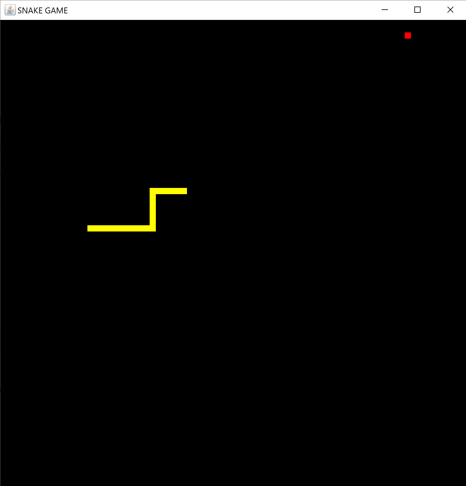

# SnakeGame
<h3> Description </h3>

A rendition of the one of our most recognisable childhood game - Snake. 

<h3> Technology Used </h3>
Built using Java & Java Swing using Intellij

<h3> Current features </h3>
<ul> 
<li> Start game menu </li>
<li> Change difficulty level: 3 modes 
    <ul>
    <li> Easy - Slowest speed </li>
    <li> Medium - Normal speed (default) </li>
    <li> Hard - Fastest speed </li>
    </ul>
    </li>
<li> Upon gameover, restart the game </li>
</ul>

<h3> Known Bugs & Possible Extensions </h3>
<ul> 
<li> Upon gameover, threads are not joined, causes lag when multiple rounds are played </li>
<li> Highscore function </li>
<li> Return to main menu OR change settings within the game </li>
<li> Pause the game </li>
<li> Different difficulties - generate an AI snake that players have to avoid </li>
<li> 2 playe functionality </li>
</ul>

<h3> Summary </h3>
Despite the known bugs and possible future extension ideas, given the way this current program is written,
it would be difficult to implement some of the fixes. These learning points will be brought over to
future games written. That's all for the first game written in Java and the first attempt
in creating a GUI using Java :D

<h3> References </h3>
<ul>
<li> <a href = "https://www.youtube.com/watch?v=91a7ceECNTc"> Basic Snake Game </a>  </li>
<li> <a href = "https://www.youtube.com/watch?v=FZWX5WoGW00"> Main Menu Function </a>  </li>
<li> <a href = "https://www.youtube.com/watch?v=qfjxLRrHS0c"> Mouse Input Listener </a>  </li>
<li> <a href = "https://www.youtube.com/watch?v=8gMd0ftWp_Y">  Highscore Function [Future Reference] </a>  </li>
